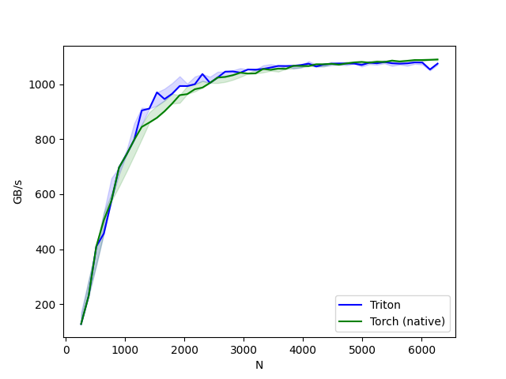
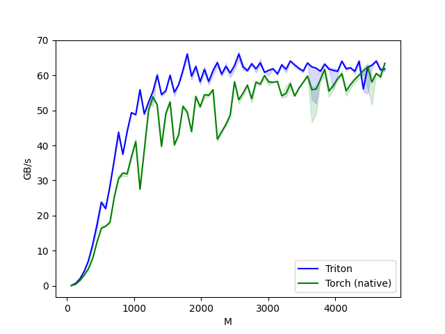
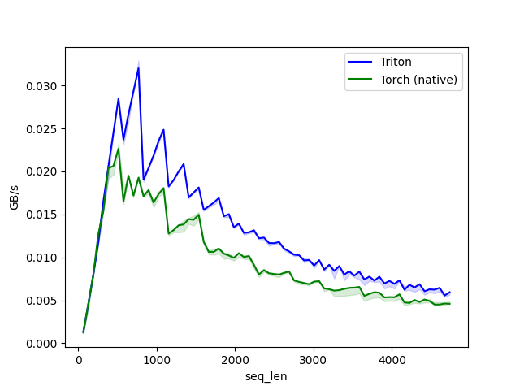
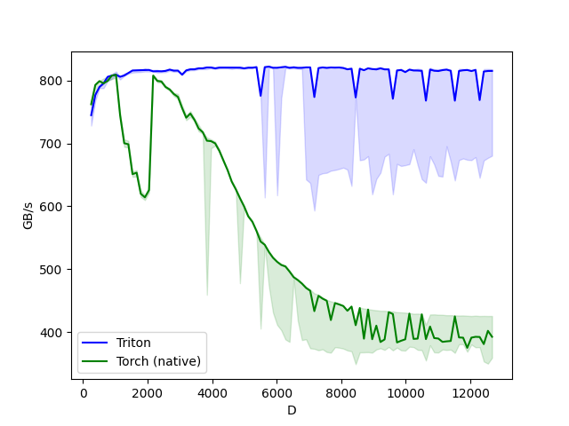
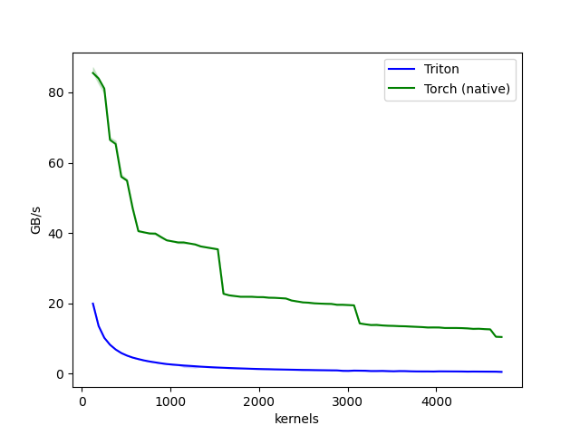
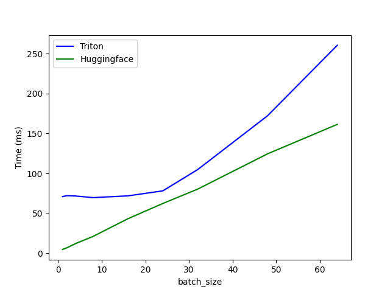

<!-- markdownlint-disable MD036 MD029 -->

# VIT.TRITON

Complete implementation of ViT (Vision Transformer) model using Triton kernels. The weights are imported from HF (HuggingFace). We have also compared the implementation against the official HF implementation. The results are in the `benchmarks` folder. You can use this ViT implementation as an education resource or in your pipeline. This implementation is completely valid and functional. It only supports forward passes for now.

Some accompanying posts can help you get started with GPU programming:

1. [Understanding GPU internals](https://cmeraki.github.io/gpu-part1.html)
2. [Understanding the GPU programming model](https://cmeraki.github.io/gpu-part2.html)

## Goals

This repo has 3 goals:

1. Learn GPU programming by learning how to write Triton kernels
2. Learn to use triton kernels in a model by implementing an architecture using PyTorch but by calling custom triton kernels
3. Learn to load model weights to a custom implementation from a different repository like HuggingFace

## Setup

If you'd like to test this implementation on your machine, all you need to do is,

```python
git clone https://github.com/cmeraki/vit.triton.git
cd vit.triton
python -m venv .venv
source ~/.venv/bin/activate
pip install -r requirements.txt                         # Requriements are suited for NVIDIA GPU and linux setup
python -m vit.vit                                       # This will run the benchmarking on both HF implementation of ViT and the custom implementation
```

## Walkthrough

```plaintext
- vit/
    - kernels/              # All triton kernels reside here
    - load_weights.py       # Functions for loading weights from HF
    - utils.py              # Utils
    - vit.py                # Architecture written in torch, but calling triton kernels
- benchmarks/               # Benchmark results
- posts/                    # Blog posts related to GPU programming 
- examples/                 # Small examples used in posts
```

TBA

## Results

> The benchmarks were run on Nvidia 3080 Ti Founders edition.

### Triton vs PyTorch

The results of benchmarks comparing custom Triton implementation with PyTorch operations are as follows (higher the better):

**add**



**layernorm**


**matmul**



**matmul3**



**softmax**



**conv2d**



### ViT.Triton vs HuggingFace

The results of benchmarks comparing custom ViT implementation with HF are as follows (the lower the better):



Currently, the HuggingFace implementation is faster, but I am working on improving it to be faster than HuggingFace! Stay tuned.

## Contact

In case you have any questions or suggestions, feel free to raise an issue!
