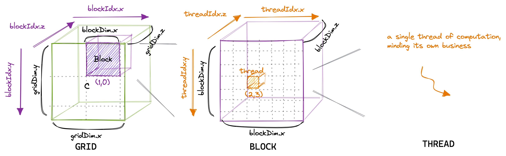
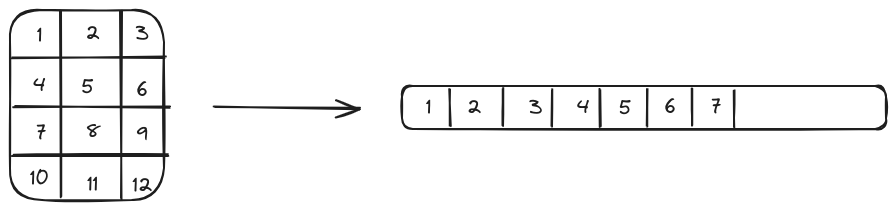
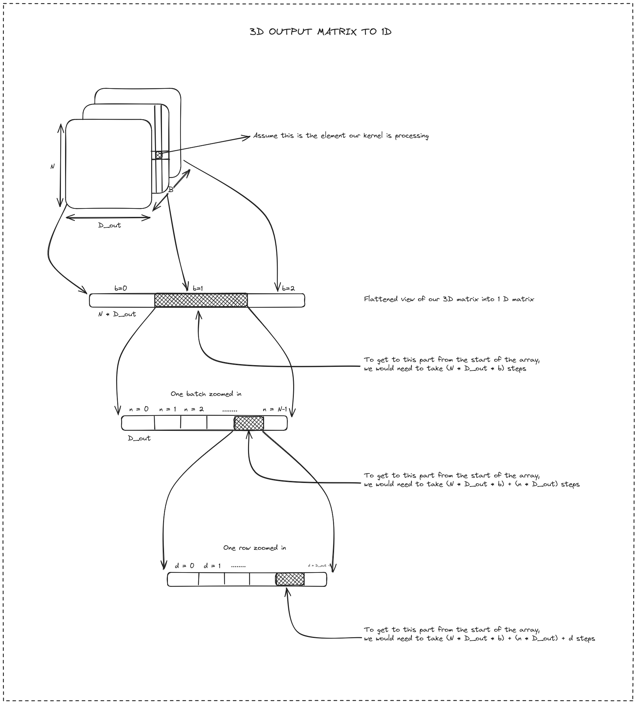
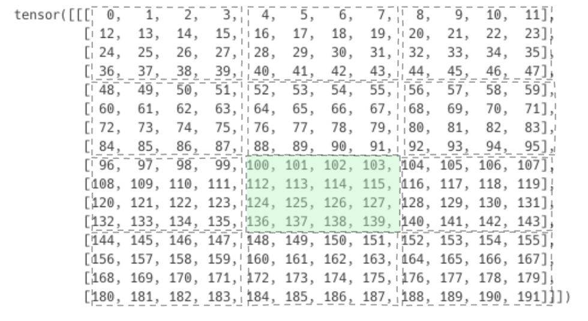
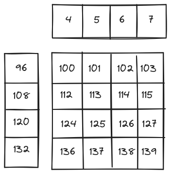

<!-- markdownlint-disable MD036 MD029 -->
# Understanding the GPU programming model

Given that you have read Part 1 of the series, you should have a basic understanding of the GPU hardware. Let's now understand the software that is used to run programs on the GPUs.

## Hardware to software mapping and programming model of the GPU

2 things to keep in mind before we start:

1. The physical concepts of hardware do not necessarily translate one-to-one to logical concepts in software.
2. In GPU programming, we write a function that needs to be executed on the GPU. This is called a kernel. We can write multiple kernels in a single program and "launch" them from the CPU.

Okay, with that out of the way, let's understand a few important concepts of GPU programming.

### Threads

Each kernel is executed by a thread in the GPU. And every thread executes the same kernel (assuming you have a single kernel in the program). This makes it necessary for us to write our kernel such that a single function can operate on all the data points. When we launch a kernel, what we are starting are GPU threads that will execute instructions written inside the kernel. We can start a lot of threads at once and these are the true powerhouse of the GPU.

All threads have some small memory associated with it which is called local memory. Apart from that, threads can also access the shared memory, L2 cache, and global memory.

Physically, threads are assigned to cores. Cores execute software threads.

### Blocks

Threads are logically organized into blocks. Every block has a pre-defined number of threads assigned to it. *Just for logical purposes*, we can arrange threads inside a block in either a 1D, 2D, or 3D array layout. You can think of blocks as an array of threads. It's important to understand that this 1D, 2D, or 3D arrangement is purely logical and for the developer's convenience only. This arrangement is provided so it's easier to visualize our input and output data. If we imagine that we want to operate on a 100x100 matrix, then we can just launch a kernel with a block size of 100 by 100 threads. That will start a total of $10^4$ (100x100) threads which we can use to map to the matrix. We can write our kernel such that every single thread operates on every single element of the matrix.

In the physical world, every block is assigned an SM. Throughout its execution, the block will only be executed on the same SM. Since every block is assigned an SM, it also has access to the SM's shared memory (which we learned in the first part). All the threads that are part of a single block can access and share this memory.

### Grids

Similar to how threads are organized in blocks, blocks are themselves organized into a grid. That helps us to launch multiple blocks at one time. As we discussed earlier, a single GPU has multiple SMs, we can launch multiple blocks at once so that all of our SMs and cores are utilized. Let's assume that our program executes 25 blocks and our GPU has 10 SMs. Then the program will execute 10 blocks in the first wave, 10 blocks in the second wave, and 5 blocks in the third wave. The first two waves will have 100% optimization but the last wave will have 50% utilization.

Blocks inside a grid can be organized in the same way that threads are organized inside a block. A grid can have a 1D, 2D, or 3D array layout of the blocks. The arrangement of blocks and threads is just logical. A single program only executes a single grid at a time.



Figure 1: Grids/Blocks/Threads layout
Source: Borrowed from [this](https://siboehm.com/articles/22/CUDA-MMM) excellent blog.

During execution, we start a total of `blocks per thread (b) * number of blocks (num)` physical threads. Each physical thread is numbered from `0` to `(b*num)-1`. So, how do you map your 2D or 3D structure of logical thread blocks to the physical thread? By unrolling.

A 2D array layout can be to 1D. If it's row-major ordering, then a 2D matrix after unrolling will look like this:



Figure 2: Element `A[2][3]` in the 2D matrix will be `A[5]` in the flattened 1D array. This is how you can think of mapping 2D blocks of thread to the 1D thread array.

When we arrange the blocks and threads in this 1D, 2D, or 3D layout, CUDA maps them to the x-axis, y-axis, and z-axis in its programming model. This will be useful in the next section.

## A simple example in CUDA

Now that you have hopefully understood what threads, blocks, and grids are, let's start with CUDA. CUDA is a programming extension of C/C++ that helps us write heterogeneous programs (that run on CPU and GPU). These programs allow us to define and launch kernels from the CPU. CUDA is very powerful and offers a lot of ways to optimize our kernels. It's just a bit ... too verbose.

Let's slowly walk through an example to understand how CUDA works. Let's implement a very naive implementation of matrix multiplication. We will be using some CUDA function calls, they should be self-explanatory, but in case they are not, just google the syntax. This is a relatively simple kernel, so should be easy to follow along. Here are the general steps of writing and launching a kernel from CUDA:

1. Allocate the memory for the data (both input and output) on the CPU memory (also called as host). We will allocate memory for our input (X), weight matrix (W), and output (O). Assuming B as the batch size, N as the number of rows or sequence length in transformers, D_in as the number of columns or embedding dimension, and D_out as the hidden dimension.

```C
float *X = (float*)malloc(B*N*D_in*sizeof(float));      // Input data
float *W = (float*)malloc(D_in*D_out*sizeof(float));    // Weights
float *O = (float*)malloc(B*N*D_out*sizeof(float));     // Output data
```

2. Allocate the memory for the data on the GPU (also called as device)

```C
float *d_X, *d_W, *d_O;

cudaMalloc((void**) &d_X, B*N*D_in*sizeof(float));      //cudaMalloc is a CUDA function and allocates memory on the GPU memory
cudaMalloc((void**) &d_W, D_in*D_out*sizeof(float));
cudaMalloc((void**) &d_O, B*N*D_out*sizeof(float));
```

3. Copy the relevant data from the CPU memory to the GPU memory. Let's assume that we have loaded `X` and `W` with relevant data. Now we transfer the data to the GPU. Just for convenience, I have prefixed the variable that will reside on GPU memory with `d_`. These variables are a copy of `X` and `W` but allocated in the GPU memory.

```C
cudaMemcpy(d_X, X, B*N*D_in*sizeof(float), cudaMemcpyHostToDevice);     // cudaMemcpy is again a CUDA function
cudaMemcpy(d_W, W, D_in*D_out*sizeof(float), cudaMemcpyHostToDevice);

```

4. Launch the kernel. Assuming that our kernel is called `matMul`, `grid` defines how the blocks are arranged and `blocks` define how threads are arranged in each block. For this example, the `grids` will be a 1D array equal to the batch size. `blocks` will have the same layout as the output dimension of our output matrix (`N*D_out`). This means that every block will process a single output matrix from the batch and every thread will process a single cell of our output matrix.

```C
// We would launch B blocks, each block processing a single batch
dim3 grid(B);
/*
We would arrange the threads inside a block in the same dimension as our output
i.e N*D_out, so that logically each thread corresponds to a single element in the
output matrix. Hence, each thread is responsible for computing a single element of the output.
*/
dim3 blocks(D_out, N); //D_out is first instead of N, because the function dim3 takes input in x, y, z notation. We can think of x axis as the columnar axis and y axis as the row axis

matMul<<<grid, blocks>>>(
    d_X,
    d_W,
    d_O,
    B,
    N,
    D_in,
    D_out
);
```

In total we have launched: `B*N*D_out` threads arranged in `B` blocks.

5. Copy the relevant data (usually only the output) from the GPU memory to the CPU memory. Once the kernel execution is completed, we need to copy the output from the GPU memory back to our CPU memory so that we can use it for any downstream processing.

```C
cudaMemcpy(O, d_O, B*N*D_out*sizeof(float), cudaMemcpyDeviceToHost);
```

These 5 steps are followed in almost all GPU programs. Let's now dive deep into the actual kernel:

```C
__global__ void matMul(
    float* X,
    float* W,
    float* OO,
    int B,
    int N,
    int D_in,
    int D_out
) {
    /*
    This kernel takes a batch of data: (B x N x Din)
    and a weight matrix: (Din X Dout)
    and produces: (B x N x Dout)
    */

    int batch = blockIdx.x;
    int row = threadIdx.y;
    int col = threadIdx.x;

    int out_offset = N*D_out*batch + row*D_out + col;

    if ((batch < B) && (col < D_out) && (row < N)) {
        float sum = 0.0f;
        for (int i = 0; i < D_in; i++) {
            sum += X[N * D_in * batch + row * D_in + i] * W[i * D_out + col];
        }
        OO[out_offset] = sum;
    }
}
```

Remember that physically there is no 2D or 3D arrangement of threads. That construct is just provided by CUDA to help us map the problems appropriately. Physically it's just a single 1D array of threads. Since we have started `B*N*D_out` threads, it maps exactly with the 1D layout of our output matrix.

To figure out which data a particular thread should process, the kernel just needs to figure out which thread is it executing. Depending on the batch, row, and column, each thread will load different parts of the input and weight matrix. These are called offsets and we have calculated three offsets in our code:

1. `batch`: Figure out which matrix in the batch this kernel is processing.`blockIdx.x` gives the block ID in the x-axis of our grid layout. Since we have a 1D grid, this is the only direction available to us.
2. `row`: Figure out within a matrix, which row is the kernel processing. Rows are mapped to the y-axis.
3. `col`: Figure out within a matrix, which column is the kernel processing. Columns are mapped to the x-axis.
4. `out_offset`: Finally, we map the thread ID to the exact cell in the output matrix. You can think of this as:
   1. Skipping `batch` matrices to arrive at our current matrix. To skip one single matrix, we would have to go ahead `N*D_out` number of elements in the flattened 1D array
   2. Skipping `row` number of rows. In a 1D flattened layout, we would skip a row by moving ahead `D_out` elements.
   3. Finally, adding `col` to the summation of the above two to arrive at our element.

Hopefully, this figure will make it clearer about the offset calculation.



Figure 3: If the output data and threads have the exact length (which in our case is true), we can just map them 1 to 1. `B`, `N`, `D_out`, are the batch size, number of rows, and number of columns in the output data respectively. `b`, `n`, `d` is `i th` batch, row, and column respectively.

After calculating these offsets, we are loading the corresponding row from `X` and the corresponding column from `W` and doing a single vector multiplication in a for loop. If you have understood the above `out_offset` calculation, it should be easy to follow this too.

The complete code is present [here](https://github.com/cmeraki/vit.triton/blob/main/examples/matmul_batch.cu). You would need to install `nvcc` (the compiler for CUDA programs), have an NVIDIA GPU to run the program, and have the CUDA drivers, and CUDA toolkit installed.

## A simple example in Triton

CUDA is amazing and lets us do a lot of optimizations. But it is quite verbose. Plus, if you are coming from the machine learning/data science domain, you are probably more familiar with Python. Open AI released a package called [Triton](https://triton-lang.org/) that provides a Python environment to write kernels and compile them for any GPU. By using Triton, you can write very performant kernels in Python directly.

But instead of working with individual threads, Triton works with blocks. Instead of each kernel being assigned a thread, in Triton each kernel is assigned a block. Triton abstracts out the thread computation completely so that you can focus on slightly higher-order computation.

In our example of matrix multiplication, instead of computing a single element of the output in our kernel, Triton can help us compute values for small "blocks" of the output matrix.


Figure 4: (Left) CUDA execution model vs (Right) Triton execution model
Source: [Triton documentation](https://triton-lang.org/main/programming-guide/chapter-1/introduction.html)

Let's reimplement the matrix multiplication example using Triton. The steps for Triton are very simple.

1. Implement a "wrapper" function to call the kernel. Below, we are calling the Triton kernel with `matmul_kernel`. We define the grid and the block sizes similar to how we do with CUDA. There are some assert statements to make sure that we don't run into any errors. When we pass the torch tensors to the kernel, triton implicitly converts it into a pointer. We just need to make sure that whatever tensors we are passing to the kernel are already on the GPU (by `x.to('cuda:0')`).
   1. Unlike CUDA however, we start a grid layout where we have 3 axes. In the first axis, we have batch size, and in the other two axes, we have the number of times it will take `BLOCK_SIZE_ROW` to cover all the rows (similarly for `BLOCK_SIZE_COL`).
   2. During execution, this means, that for kernel will process - `BLOCK_SIZE_ROW x BLOCK_SIZE_COL` sub-matrix in the input for every, one input in the batch.

```python
def matmul(input: torch.Tensor, weight: torch.Tensor) -> torch.Tensor:
    """
    Implements matrix multiplication between two matrices. The input matrix is 3 dimension where
    first dimension is the batch size. The weight matrix will be multiplied with each of the batches
    of the input matrix.

    Args:
        input (torch.Tensor): Matrix with dimension (B x N x D_in)
        weight (torch.Tensor): Matrix with dimension (D_in x D_out)

    Returns:
        torch.Tensor: Ouptut matrix with dimension (B x N x D_out)
    """    """"""
    assert input.is_cuda, 'Inputs are not on GPU, ensure the input matrix is loaded on the GPU'
    assert weight.is_cuda, 'Weights are not on GPU, ensure the weight matrix is loaded on the GPU'
    assert input.shape[-1] == weight.shape[-2], 'Input and weight matrix are not compatible'

    B, N, D_in = input.shape
    _, D_out = weight.shape

    output = torch.empty((B, N, D_out), device=input.device, dtype=input.dtype)

    BLOCK_SIZE_ROW, BLOCK_SIZE_COL = 16, 16
    # We are launching the grid to align with the output
    grid = lambda meta: (B, triton.cdiv(N, meta["BLOCK_SIZE_ROW"]), triton.cdiv(D_out, meta["BLOCK_SIZE_COL"]))

    matmul_kernel[grid](
        input_ptr=input,
        input_batch_stride=input.stride(0),
        input_row_stride=input.stride(1),
        input_col_stride=input.stride(2),
        weight_ptr=weight,
        weight_row_stride=weight.stride(0),
        weight_col_stride=weight.stride(1),
        output_ptr=output,
        output_batch_stride=output.stride(0),
        output_row_stride=output.stride(1),
        output_col_stride=output.stride(2),
        num_rows=N,
        num_input_cols=D_in,
        num_output_cols=D_out,
        BLOCK_SIZE_ROW=BLOCK_SIZE_ROW,
        BLOCK_SIZE_COL=BLOCK_SIZE_COL
    )

    return output
```

2. That's it. Notice that we are using tensor strides (eg: `input.stride(0)`). Read more about that [here](https://pytorch.org/docs/stable/generated/torch.Tensor.stride.html). This is useful for us to figure out how much should we jump to go to the next batch or row in the 1D flattened view of the 3D matrix. This will come in handy in the actual kernel. Once the kernel's execution is complete, the output will be available in the tensor that we passed.

Now, let's deep dive into the kernel. We have to decorate the Triton kernel with a function `@triton.jit` for Triton to know that this is a function that will be executed on the GPU.

```python
@triton.jit
def matmul_kernel(
    input_ptr,
    input_batch_stride,
    input_row_stride,
    input_col_stride,
    weight_ptr,
    weight_row_stride,
    weight_col_stride,
    output_ptr,
    output_batch_stride,
    output_row_stride,
    output_col_stride,
    num_rows,
    num_input_cols: tl.constexpr,
    num_output_cols,
    BLOCK_SIZE_ROW: tl.constexpr,
    BLOCK_SIZE_COL: tl.constexpr,
):
    # Getting block indexes in all 3 dimensions
    batch_idx = tl.program_id(0)
    row_idx = tl.program_id(1)
    col_idx = tl.program_id(2)

    # Offsets for input data
    input_batch_offset = batch_idx * input_batch_stride                                 # Offsets to reach to the correct batch. Similar to CUDA, here we directly use stride

    input_row_offset = row_idx*BLOCK_SIZE_ROW + tl.arange(0, BLOCK_SIZE_ROW)
    input_row_mask = input_row_offset[:, None] < num_rows
    input_row_offset = input_row_offset[:, None] * input_row_stride # Selecting relevant rows from input

    input_col_offset = tl.arange(0, num_input_cols)
    input_col_mask = input_col_offset[None, :] < num_input_cols
    input_col_offset = input_col_offset[None, :] * input_col_stride # Selecting all columns from input

    input_data_ptr = input_ptr + input_batch_offset + input_row_offset + input_col_offset
    input_data = tl.load(input_data_ptr, mask=(input_row_mask & input_col_mask)) # BLOCK_SIZE_ROW x D_in

    # Offsets for weight data
    weight_row_offset = tl.arange(0, num_input_cols)
    weight_row_mask = weight_row_offset[:, None] < num_input_cols
    weight_row_offset = weight_row_offset[:, None] * weight_row_stride # Selecing all rows from weight

    weight_col_offset = col_idx*BLOCK_SIZE_COL + tl.arange(0, BLOCK_SIZE_COL)
    weight_col_mask = weight_col_offset < num_output_cols
    weight_col_offset = weight_col_offset[None, :] * weight_col_stride # Selecting relevant columns from input

    weight_data_ptr = weight_ptr + weight_row_offset + weight_col_offset
    weight_data = tl.load(weight_data_ptr, mask=(weight_row_mask & weight_col_mask)) # D_in x BLOCK_SIZE_COL

    # Computation
    result = tl.dot(input_data, weight_data) # Matmul of a small block, BLOCK_SIZE_ROW x BLOCK_SIZE_COL

    # Offsets for output data
    output_batch_offset = batch_idx * output_batch_stride                               # Offsets to reach to the correct batch. Similar to CUDA, here we directly use stride

    output_row_offset = row_idx*BLOCK_SIZE_ROW + tl.arange(0, BLOCK_SIZE_ROW)
    output_row_mask = output_row_offset[:, None] < num_rows
    output_row_offset = output_row_offset[:, None] * output_row_stride

    output_col_offset = col_idx*BLOCK_SIZE_COL + tl.arange(0, BLOCK_SIZE_COL)
    output_col_mask = output_col_offset[None, :] < num_output_cols
    output_col_offset = output_col_offset[None, :] * output_col_stride

    output_data_ptr = output_ptr + output_batch_offset + output_row_offset + output_col_offset
    tl.store(output_data_ptr, result, mask=(output_row_mask & output_col_mask))
```

Similar to CUDA, we get the current index of the block. But keep in mind, unlike CUDA where we process a single element of the output matrix, we are processing a single block (which is a 2D arrangement of a few elements). `tl.program_id` function helps us in getting the index position in every axis.

1. `batch_idx` gets us the output matrix in the batch
2. `row_idx` gets us the block number along the rows. Remember, this is not equal to the row number as in CUDA
3. `col_idx` gets us the block number along the columns. Remember, this is not equal to the column number as in CUDA

Once we have all these 3 numbers, what we need to do is create a 2D representation of the data we want to load for computation. We have to take some dummy numbers to understand what is happening here. Assume that `B = 1`, `N = 16`, and `D_out = 12`. Our block size in both column and row dimensions is 4 (i.e. `BLOCK_SIZE_ROW` and `BLOCK_SIZE_COL` is 4). So each block will be a 2D matrix of dimension (4 x 4).

Based on this

```python
grid = lambda meta: (B, triton.cdiv(N, meta["BLOCK_SIZE_ROW"]), triton.cdiv(D_out, meta["BLOCK_SIZE_COL"]))
```

we would have the grid configuration as (1, 4, 3). We would be launching a total of 12 blocks. Now, what would it take to load the block with rows 8 to 11 and columns 4 to 7? Based on simple arithmetic, it looks like we should be loading `(1, 2, 1)`th block where the first dimension corresponds to the batch dimension, the second dimension corresponds to the row dimension and the third dimension corresponds to the column dimension. This would correspond to

```python
tl.program_id(axis=0) == 1
tl.program_id(axis=1) == 2
tl.program_id(axis=2) == 1
```

In this `(1, 2, 1)`th block, how should we prepare our offsets? In the 1D representation of the matrix, we want to load the elements highlighted in green.



Figure 5: `(1 x 16 x 12)` matrix is divided into blocks of size `(4 x 4)`. `1, 2, 1`th block is highlighted. The value at every place is the index of that position in the 1D flattened array.

```python
# Offsets for output data
output_batch_offset = batch_idx * output_batch_stride                           

output_row_offset = row_idx*BLOCK_SIZE_ROW + tl.arange(0, BLOCK_SIZE_ROW)       # This arangement happens in 1D, tl.arange is like Python's arange
output_row_mask = output_row_offset[:, None] < num_rows                         # Think of masks as preventing us to read invalid data from memory
output_row_offset = output_row_offset[:, None] * output_row_stride              # This arangement converts a 1D vector to a 2D vector with (n, None) shape

output_col_offset = col_idx*BLOCK_SIZE_COL + tl.arange(0, BLOCK_SIZE_COL)       # This arangement happens in 1D, tl.arange is like Python's arange
output_col_mask = output_col_offset[None, :] < num_output_cols                  # Think of masks as preventing us to read invalid data from memory
output_col_offset = output_col_offset[None, :] * output_col_stride              # This arangement converts a 1D vector to a 2D vector with (None, n) shape
```

Let's decode what is happening here

```python
output_row_offset = row_idx*BLOCK_SIZE_ROW + tl.arange(0, BLOCK_SIZE_ROW)
# row_idx = tl.program_id(1) = 2, BLOCK_SIZE_ROW = 4
# output_row_offset = 2*4 + (0, 1, 2, 3) = (8, 9, 10, 11)
```

If we add it directly to our `output_ptr` we will get the 8th, 9th, 10th, and 11th element from the 1D flattened matrix. We don't want that. We want the highlighted elements. So we do a transformation:

```python
output_row_offset = output_row_offset[:, None] * output_row_stride
# This multiplies each element by the output_row_stride which is equal to 12 (number of columns), the number of elements we would skip in 1D array to reach the start of next row
# ouput_row_offset becomes (96, 108, 120, 132). But it also gets transformed into a row vector
```

```python
output_col_offset = col_idx*BLOCK_SIZE_COL + tl.arange(0, BLOCK_SIZE_COL)
# col_idx = tl.program_id = 1, BLOCK_SIZE_COL = 4
# output_col_offset = 1*4 + (0, 1, 2, 3) = (4, 5, 6, 7)
```

We do a similar transformation here:

```python
output_col_offset = output_col_offset[None, :] * output_col_stride
# This multiplies each element by the output_col_stride which is equal to 1, the number of elements we would skip in 1D array to advance by one column.
# Since this is a row major ordering, columns are adjacent to each other.
# ouput_col_offset becomes (4, 5, 6, 7). But it also gets transformed into a column vector
```

Finally,

```python
output_data_ptr = output_ptr + output_batch_offset + output_row_offset + output_col_offset       # Adds all the offsets to the pointer
```

Here, we first add `output_row_offset` and `output_col_offset`. Since one of them is a row vector and the other is a column vector, we would get a 2D array with all the desired indices of all the elements we wanted to load. After that, we add `output_batch_offset` to get to the correct matrix in the batch.



Figure 6: How 2D blocks are created from 2 1D offsets

This gives us the appropriate data. You can similarly load the relevant data for other tensors. The rest of the code is more about syntax rather than any core logic. So I'll leave that for you to explore. But if you understand the offset calculation properly, you should be able to write your kernels independently.

The complete code is present [here](https://github.com/cmeraki/vit.triton/blob/main/examples/matmul_batch.py). You just need Triton and Torch for this example.

## How you can rewrite the complete architecture using optimized kernel

Congrats on making this far away. Now that you understand the basics of GPU hardware and its programming model, you can go ahead and implement any network from scratch, this time not relying on PyTroch for operations but writing your kernels in CUDA or Triton.

What would you require for that? If you want to implement a transformer encoder network, you would need to implement all the basic layers and operations in Triton or Kernel.

1. Matrix multiplication
2. Layernorm
3. Softmax
4. Addition
5. Concatenation

You can then wrap these kernels in the PyTorch module and load weights from HF to compare your implementation with other PyTorch/TF native implementations. If this sounds interesting, this is exactly what we did too. We implemented most of the operations used in Vision Transformer (including patching and addition operations) in Triton and used HF weights to run a forward pass. You can look at the code [here](https://github.com/cmeraki/vit.triton) and maybe implement your favorite model too using custom kernels!
